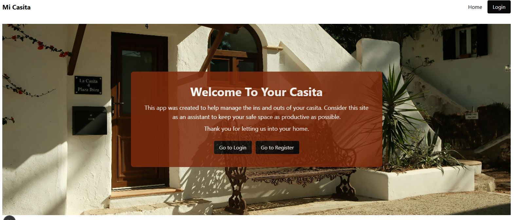
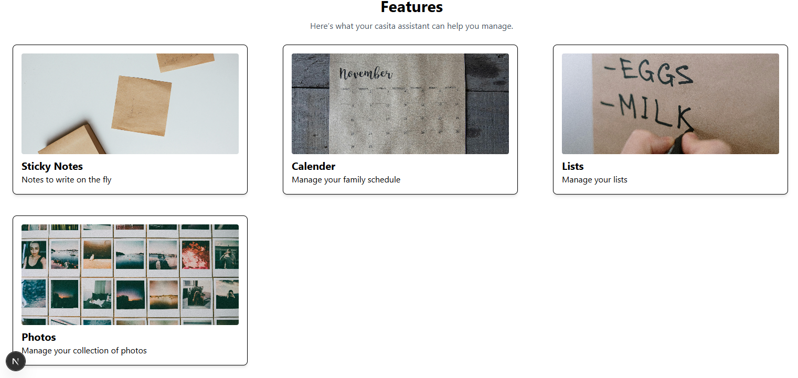
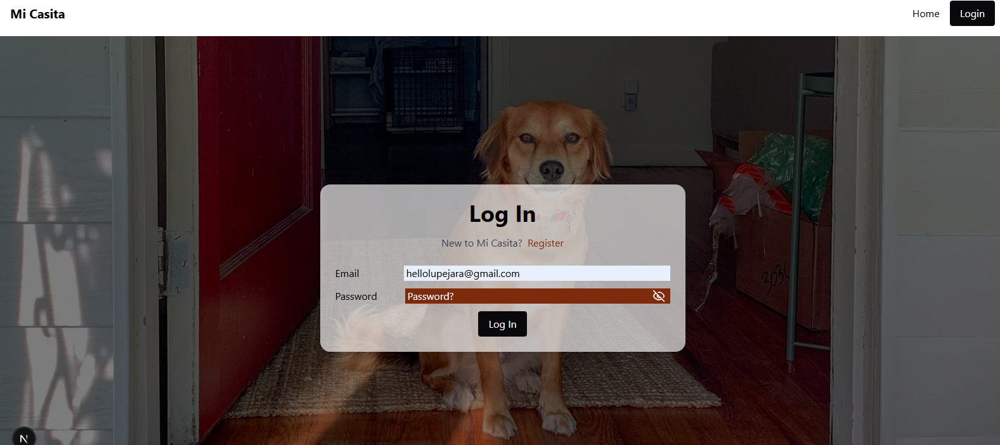
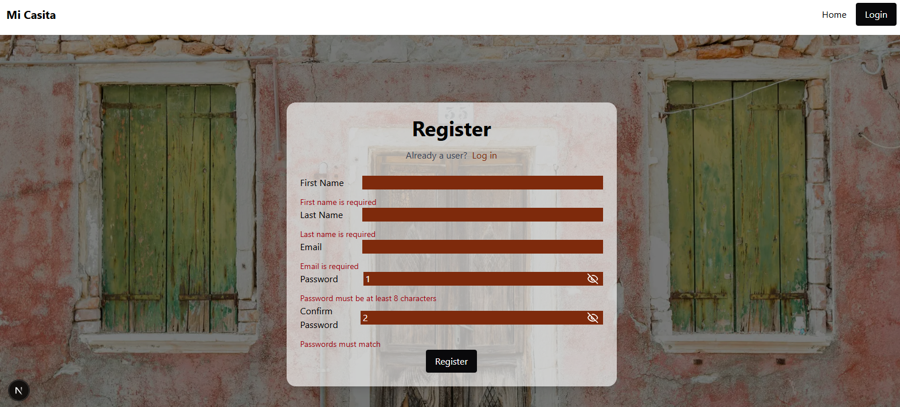
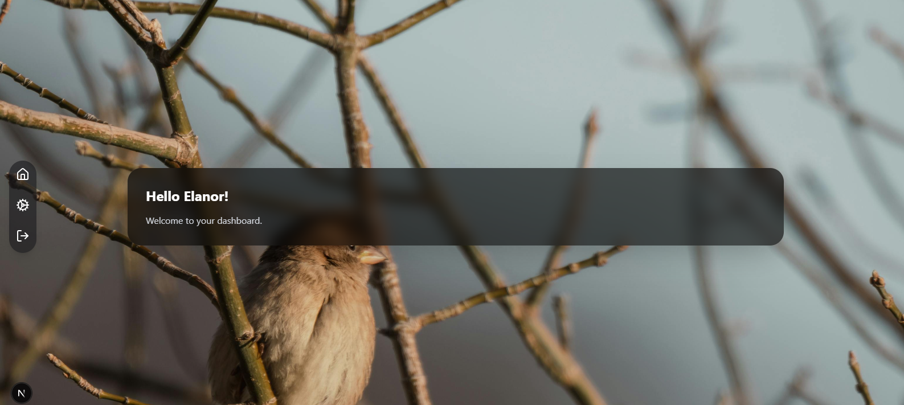
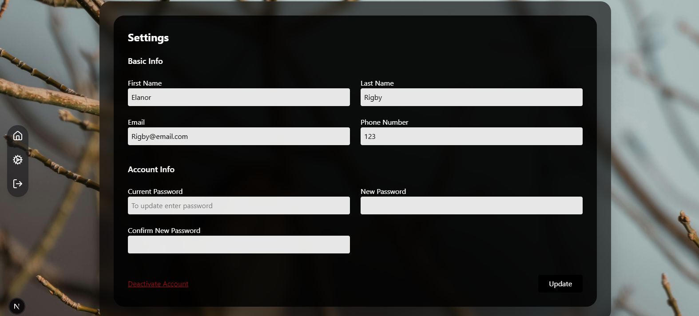
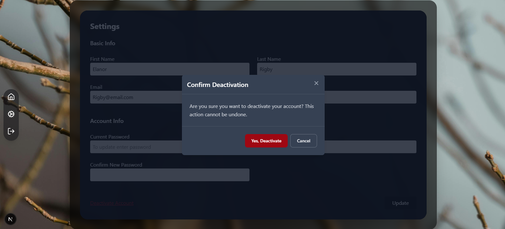

# Mi_Casita
**`Full Stack Project`**

This app was created as inspired from DAKboard for a customizable display used on tablets. The idea for this project was inspired for creating a centralized home organization system by including multi UI calander managment, sticky notes, reminders, lists, and messaging system. The goal is to also make it kid friendly by providing extra features like drawing board, emoji stickers, and sticky notes. 

- Developed and tested responsive webpages using Tailwind CSS and React for the frontend, with Next.js and Firebase for backend management.

- Integrated third-party libraries such as Yup and Formik to enforce schema-based data validation, streamlining quality control and improving data accuracy.

- Implemented user authentication and data handling with Firebase OAuth, including login/logout functionality, update user information and secure hard deletes of user data.

- Built secure HTTP routes based on user roles and page requirements, ensuring seamless navigation between public and authenticated user pages.

- Designed a dynamic settings form that pre-populates user information from the database, supports updates, and includes a modal for secure account deactivation.

